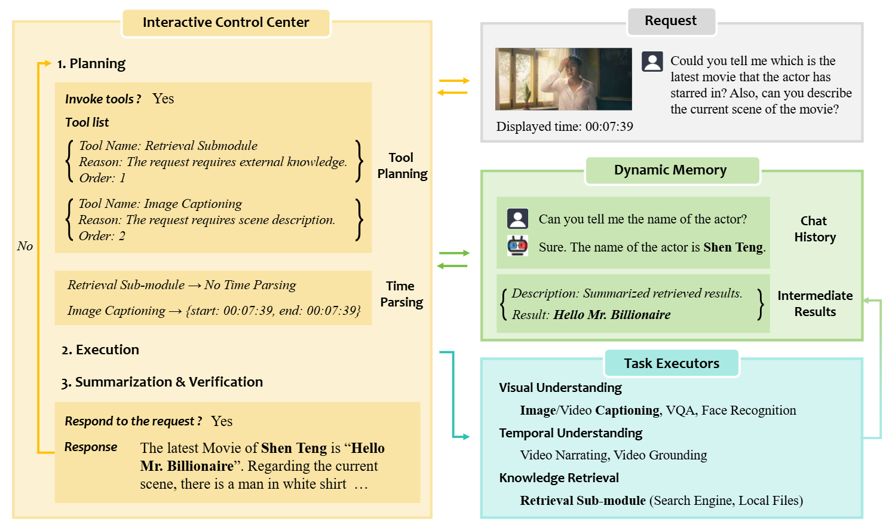
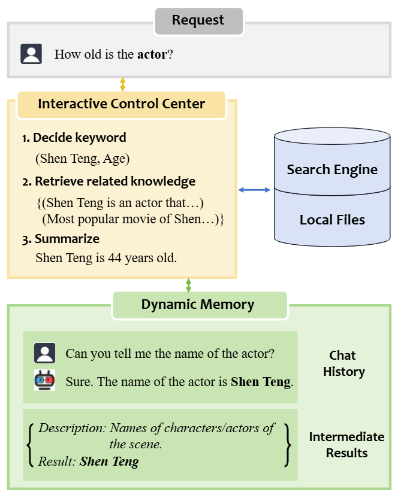
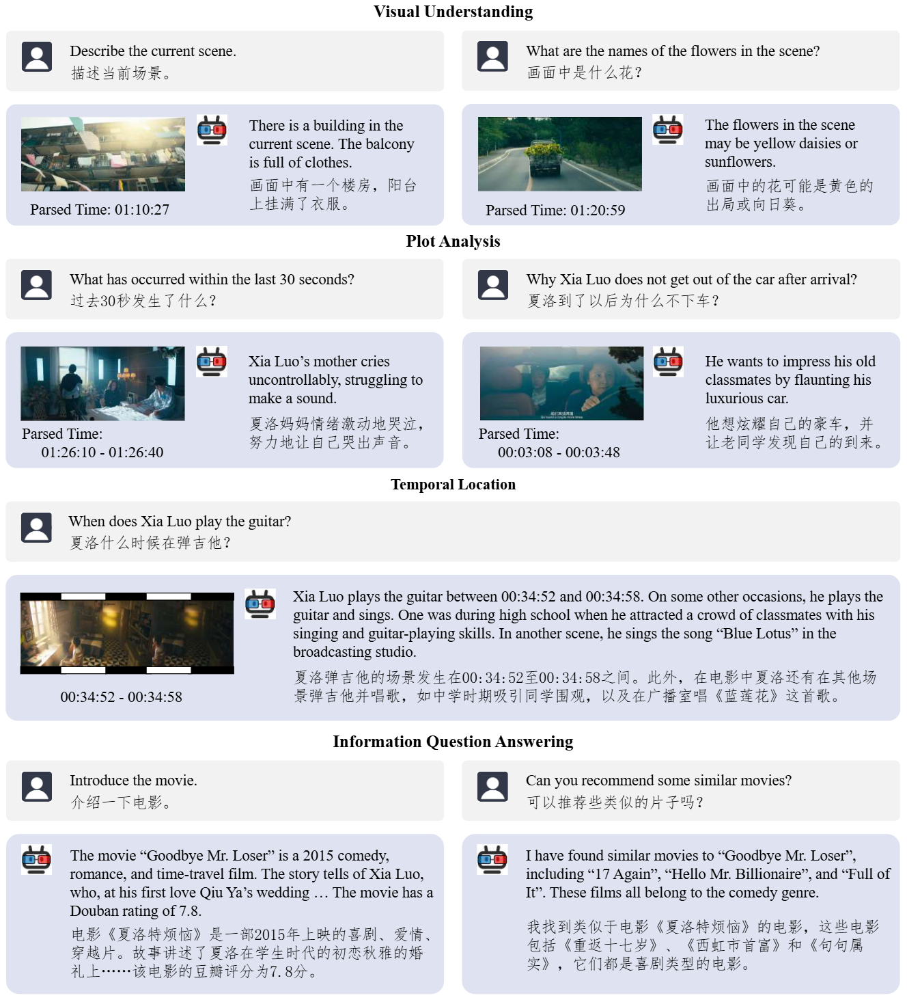
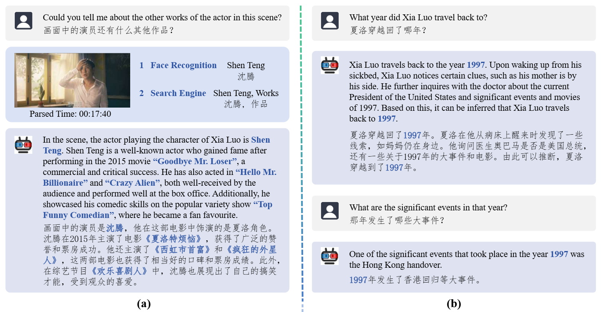

# MoCha: Let's Chat about Movies

梅雨婷 2023103731

## Introduction
大型语言模型（LLMs）在遵循指令、类似聊天的互动和组合推理方面表现出色。最近，对多模态信息的理解需求提出了为LLM增强视觉感知的课题。某些方法致力于设计视觉编码器和LLM之间的连接层，以实现端到端的微调。或者，一些方法利用LLM作为中心控制器进行规划和推理，将特定任务交给专家模型来完成，从而形成使用工具的系统或通用的视频理解系统。由于训练模型需要大量计算资源和精心构建的指令数据，我们遵循这些先例设计MoCha，这是一个为电影理解而设计的互动聊天机器人系统。

受人类回答电影相关问题方式的启发，我们设计MoCha包含三个模块：Interactive Control Center、Task Executors和Dynamic Memory。在接收到请求后，Interactive Control Center模块分析生成计划所需的外部信息并识别相关的时间段。接着，根据计划调用Task Executors，并将中间结果存储在Dynamic Memory中。最后，Interactive Control Center基于聊天历史和存储在Dynamic Memory中的中间结果总结出响应，并进行质量自验证。LLM的规划与总结能力结合任务特定的执行模块，使得MoCha能够应对多种请求，包括视觉理解、情节分析、时间定位和信息问答。我们将在后续章节中概述相关工作并详细介绍MoCha。

## Related Work
根据是否需要训练，我们将相关工作分为两类：对话式大型多模态模型和基于工具的视觉理解系统。

**对话式大型多模态模型**  
GPT-4支持图像和文本输入，是此类别中的典型代表。继GPT-4之后，许多大型多模态模型（LMMs）通过可学习查询、投影层或适配器将视觉输入注入到LLM中。在视频理解领域，ChatBridge、Macaw-LLM、VideoChatGPT、Video-LLaMA和Valley设计了各种模块来从视频中提取时空信息。除了连接机制外，VideoChat引入了生成额外文本描述的感知工具以提供辅助。MovieChat结合滑动窗口和长期记忆与LLM，实现对长视频的问答。

尽管对话式LMMs在统一多模态输入方面取得了成功，但在处理组合任务时受限于输入/输出格式。此外，这些LMMs需要大量的计算资源和指令数据，因此通常通过采样帧来处理视频，导致其在长视频理解上的能力有限。

**基于工具的视觉理解系统**  
自从ReAct引入了推理-行动（Reasoning-Acting）范式后，许多方法探索将LLM作为中央控制器，并将其与各种工具库相结合，如HuggingFace API、Restful API和Python程序。为了解决组合视觉任务，VisProg和Visual ChatGPT将GPT-3/ChatGPT与现成的计算机视觉模型结合。MM-ReAct和ChatVideo使用视觉专家来注释视频的属性，以实现跨模态理解。AssistGPT将任务特定的模型与感知工具结合，以生成多模态结果。

由于视觉理解由专家模型获得，这些系统能够以较低的成本展示更高的任务能力和灵活性。在本文中，我们基于这些先例，致力于构建一个互动式的电影理解系统。

## Method
MoCha 由三个模块组成：Interactive Control Center（由LLM实现）是 MoCha 的控制中心，既与用户互动，也与其他模块互动。 Task Executors 由外部模型和工具组成，是处理特定任务的专家。 Dynamic Memory 包含两种信息——中间结果和聊天历史，并以动态方式维护。这些模块的组合有助于理解和响应各种类型的请求。

我们将响应请求的过程分为三个阶段：规划、执行和总结与验证。在规划阶段，Interactive Control Center 分析用户的请求并规划工具的调用。然后，在执行阶段根据计划调用 Task Executors 以获得中间结果。最后，在总结与验证阶段，Interactive Control Center 收集所有中间结果以总结简短的回应并进行自我验证。通过验证的回应将被添加到 Dynamic Memory 中，以帮助未来的分析。在这些阶段中，Interactive Control Center 都可以访问 Dynamic Memory。下图提供了模块和阶段的概览。以下部分将详细介绍这些阶段。

### Planning

规划阶段在接收到用户请求后开始。Interactive Control Center 首先被提示回答两个关键问题：尽管 Dynamic Memory 中已存储了一些信息，它是否需要外部信息来响应？如果是，应该使用哪些工具，调用顺序是什么？Interactive Control Center 还会识别用户感兴趣的时间范围，因为 MoCha 被设计为回答与电影相关的请求，识别用户所指的时间很重要。

**工具规划**  
我们首先描述哪些请求需要外部信息，并要求 Interactive Control Center 通过回答 yes 或 no 来决定是否调用工具。此类请求可以分为三种类型：视觉相关、时间相关和知识相关，使用场景和示例请求列于下表中。如果 Interactive Control Center 决定 no，它将被要求直接生成响应。否则，Interactive Control Center 将被要求从 Task Executors 中选择工具，给出选择原因，并决定工具的调用顺序，输出格式为[\{Tool Name: 所选工具名称, Reason: 选择此工具的原因, Order: 工具的调用顺序\}]。工具提供给 Interactive Control Center 时会附有简短的描述和示例请求。一个工具可以多次调用，因为中间结果的积累可能会改变结果。例如，搜索引擎可以用不同的关键词进行调用。

|                       | **视觉相关**                     | **时间相关**                       | **知识相关**                     |
|-----------------------|----------------------------------|------------------------------------|----------------------------------|
| **使用场景**           | 视觉理解                          | 剧情分析 & 时间定位                | 信息问答                         |
| **示例**               | 描述当前场景。                   | 为什么马东梅晕倒了？               | 推荐类似的电影。                 |
|                       | 场景中有多少人？                 | 过去一分钟发生了什么？            | 介绍这个演员。                   |
|                       | 夏洛穿的是什么颜色的衣服？      | 夏洛什么时候弹吉他？              |                                  |

**时间解析**  
如果请求或所选工具关注一个片段或特定场景，则开始时间解析。给定所选模型、用户请求、请求发出时电影的显示时间以及上下文示例，Interactive Control Center 将输出用户感兴趣的时间范围。输出格式为 \{start: hh:mm:ss, end: hh:mm:ss\}。如果 start 和 end 相同，Interactive Control Center 会将特定场景保存到 Dynamic Memory 中；否则，将保存一个片段。不同的工具可能关注不同的时间范围。

 
### Execution

在执行阶段，Task Executors 根据计划被调用，并将中间结果附加到 Dynamic Memory 中。由于 MoCha 侧重于电影理解，我们基于功能选择 Task Executors，而非大量工具库，从而形成轻量但灵活的框架。我们在下文中介绍 Task Executors，下表总结了它们。

| **名称**                | **时间解析** |                | **描述**                               | **请求示例**               | **结果描述**                          |
|-------------------------|------------------|----------------|-----------------------------------------------|-----------------------------------|------------------------------------------------|
|                         | **scene**        | **clip**       |                                               |                                   |                                                |
| Image Captioning         | ✓                | ×              | 图像字幕模型使用自然语言描述场景。             | 描述当前场景。                     | 场景描述。                                     |
| Video Captioning         | ×                | ✓              | 视频字幕模型使用自然语言描述视频片段。       | 屏幕上过去一分钟显示了什么？       | 视频片段描述。                                 |
| Visual Question Answering| ✓                | ×              | 视觉问答模型根据视觉信息回答问题。            | 卡车上的花叫什么名字？             | 答案列表，格式为 \{[score: 置信分数, answer: 问题的预测答案]\}。置信分数越高，答案越可靠。 |
| Face Recognition         | ✓                | ×              | 人脸识别模型识别场景中的角色及相应演员。       | 角色/演员是谁？                   | 场景中的角色/演员名称。                       |
| Video narration          | ×                | ✓              | 视频旁白模型为视频片段生成叙述。               | 过去三分钟发生了什么？             | 视频片段的叙述，可能包含角色名称。             |
| Video Grounding          | ×                | ×              | 视频定位模型使用自然语言查询定位时间范围。   | 什么时候夏洛弹吉他？               | 查询的时间定位，格式为（开始时间戳，结束时间戳）。 |
| Retrieval Sub-module     | ×                | ×              | 检索子模块在互联网上或本地文件中搜索特定内容，并返回检索结果。 | 这个演员的生日是什么时候？         | 检索结果的总结。                              |

**视觉理解**  
电影理解系统的最基本功能是描述当前场景并回答与视觉相关的问题。因此，我们选择了图像字幕、视频字幕和视觉问答模型作为初始模块，以奠定扎实的视觉感知基础。由于角色在电影中扮演着重要角色，我们采用人脸识别模型来识别演员和角色。

**时间推理**  
为满足复杂时间相关任务的需求（如情节分析和时间定位），我们为 MoCha 配备了视频旁白和定位模型。视频旁白模型将时间信息融入情节描述中，而定位模型能够精确定位自然语言描述的时间。

**知识检索**  
搜索引擎和本地文件可以用来获取外部知识。与任务特定的模型不同，大多数外部检索的知识噪声大且不相关。因此，我们设计了一个简单高效的子模块，使搜索引擎能够与 Interactive Control Center 交互，如下图所示。

该模块首先提示 Interactive Control Center 根据请求决定关键词以提高检索效率。由于 Interactive Control Center 可以访问包含当前中间结果和聊天历史的 Dynamic Memory，它能区分请求的未解决部分。例如，如果用户的请求是 演员几岁，而当前中间结果或 Dynamic Memory 包含 演员的名字，则理想输出为 (\#actor\_name\#, age)。一旦搜索引擎返回关键词的top-k结果，Interactive Control Center 将提取与请求相关的知识并生成摘要。为确保 MoCha 对电影有必要的理解，无论请求如何，我们还会搜索电影标题并将结果存储在 Dynamic Memory 中。对于结构化的本地文件，我们提供可读接口，并要求 Interactive Control Center 总结与请求相关的细节。

这一最小化的工具集足以解决复杂任务。例如，当用户请求屏幕上演员的电影推荐时，Interactive Control Center 首先调用人脸识别模型识别演员，然后利用搜索引擎获取更多信息。所有中间结果以格式 \{Result Description: 结果内容的描述, Result: 由模型生成的原始结果或从外部知识检索的结果\} 存储在 Dynamic Memory 中。

### Summarization \& Verification

在获得所有中间结果后，Interactive Control Center 收集这些结果并生成简短的响应。由于语言解码的随机性，前几个阶段可能会产生错误传播。为解决此问题，Interactive Control Center 会判断响应是否全面地回答了请求。如果答案为 no，当前的中间结果将从 Dynamic Memory 中移除，整个过程将从规划阶段重新开始。只有通过验证的响应才会附加到 Dynamic Memory 中，以供将来参考。

## Qualitative Analysis

MoCha 可以通过模块化设计处理多种请求。本节总结了四种常见的使用场景。案例展示在图中：

- **视觉理解**  
  请求涉及视觉内容，例如描述场景、识别演员或回答关于场景的问题。由于在调用任务执行模块之前会进行时间解析，该请求可以参考用户错过的先前场景中的重要信息。

- **剧情分析**  
  请求涉及理解片段的剧情，例如总结剧情或解释角色的意图。剧情分析具有挑战性，因为系统需要利用时间信息来解读视觉内容背后的故事情节。

- **时间定位**  
  请求要求在电影中定位特定的动作或场景，例如确定角色执行特定动作的时间。

- **信息问答**  
  请求询问有关电影的基本信息，例如介绍电影或推荐类似的电影。

此外，我们在下图中展示了两个组合任务的案例。在案例 (a) 中，交互控制中心的规划能力帮助 MoCha 先进行人脸识别以识别演员，然后搜索更多信息。在案例 (b) 中，MoCha 成功基于存储在动态记忆中的聊天历史回答了问题。

